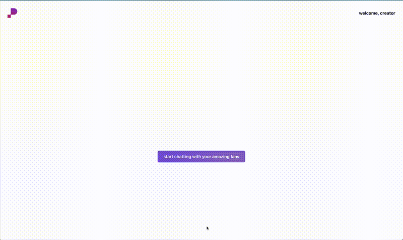

# HTN-2024

Our project was an idea inspired by Lucy Guo; in-CRM personalized mass messaging for content creators + chat functionality.

This video is a loop of our landing page loading, and I stopped the video immediately after entering a personalized chat.

Basically, content creators could have a tailored AI persona (in this repo implemented using Groq AI) that could discuss with the users and they could "interact" with the content creator on some tier-based plan.

This allows content creators to monetize their persona outside of content creation, as well as send mass messages written by them specifically too. The plan is higher engagement, higher audience retention.
